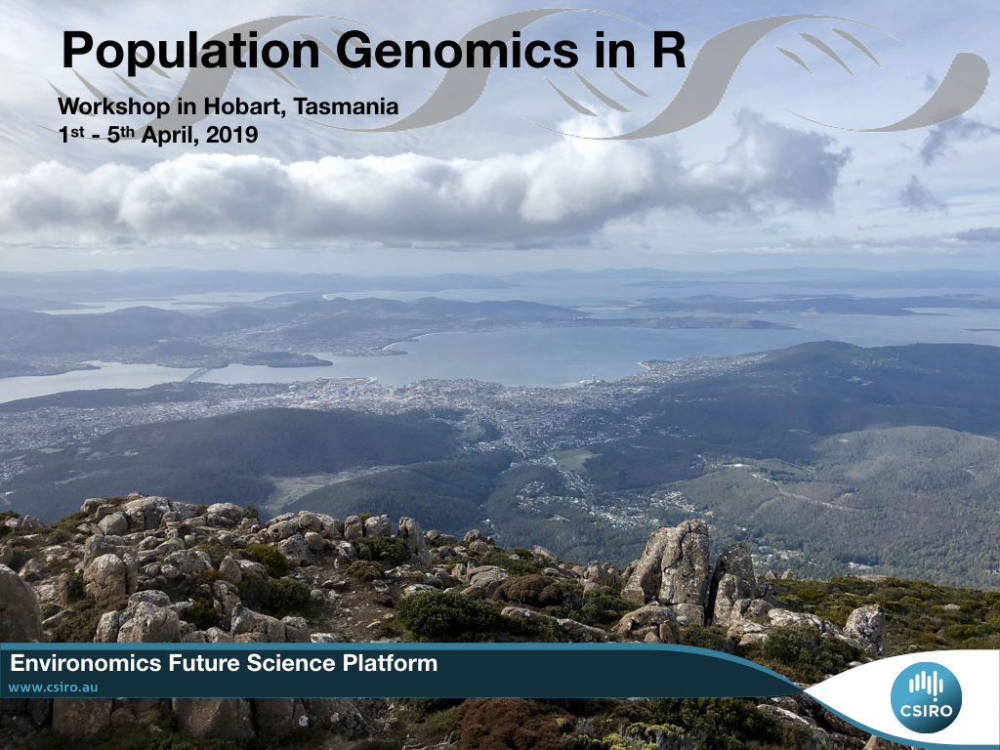

## Workshop program [pdf](https://www.dropbox.com/s/7lq1qc33fxrsq3g/R%20workshop%20Program%20Final.pdf?dl=0)

## Use this platform to :

* Ask questions outside talks or to get more info on a topic
* Exchange ideas: [see the wikipedia section](https://github.com/thierrygosselin/genomics-workshops/wiki)
* Access [datasets](https://github.com/thierrygosselin/genomics-workshops/blob/master/data/README.md) and [tutorials](https://github.com/thierrygosselin/genomics-workshops/blob/master/tutorials/tutorials.md)

## Using GitHub

GitHub can be intimidating at first, but it's worth the initial effort:

* [Get started with github](https://github.com/thierrygosselin/genomics-workshops/blob/master/tutorials/workshop_general/github_tutorial.md)
* [Happy Git and GitHub for the useR](https://happygitwithr.com) by Jenny Bryan and Jim Hester

## Nearby CSIRO and Workshop:

**Groceries** 

* [Salamanca Fresh](https://maps.apple.com/?address=41%20Salamanca%20Place,%20Hobart%20TAS%207000,%20Australia&auid=14359921724135884674&ll=-42.887001,147.332046&lsp=9902&q=Salamanca%20Fresh&_ext=ChkKBAgEEBYKBAgFEAMKBQgGEJ8BCgQIChAAEiYpNy3CbRxyRcAx06UI6G1qYkA5uVecEfZwRcBBQertV9JqYkBQBA%3D%3D&t=m)
* [Wursthaus Kitchen](https://maps.apple.com/?address=1%20Montpelier%20Retreat,%20Battery%20Point%20TAS%207004,%20Australia&auid=18127385654682773430&ll=-42.886856,147.331461&lsp=9902&q=Wursthaus%20Kitchen&_ext=ChgKBAgEEBYKBAgFEAMKBAgGEBQKBAgKEAASJimxgb5NLnJFwDEYie0HZmpiQDkzrJjxB3FFwEEKAw14ympiQFAE&t=m)

**Bakery:** Jackman & McRoss, on [Hampden](https://maps.apple.com/?address=57-59%20Hampden%20Road,%20Battery%20Point%20TAS%207004,%20Australia&auid=14467443130248930628&ll=-42.889481,147.333405&lsp=9902&q=Jackman%20%26%20McRoss&_ext=ChgKBAgEEBYKBAgFEAMKBAgGEAgKBAgKEAASJilVoSaubXJFwDEgC3MHeWpiQDnXywBSR3FFwEGW6mB43WpiQFAE&t=m) and on [Victoria](https://maps.apple.com/?address=4%20Victoria%20Street,%20Hobart%20TAS%207000,%20Australia&auid=1011877028137122627&ll=-42.885123,147.326985&lsp=9902&q=Jackman%20%26%20McRoss&_ext=ChgKBAgEEBYKBAgFEAMKBAgGEAgKBAgKEAASJil3+FX82XFFwDE3xBxRRWpiQDn5IjCgs3BFwEHBrSnAqWpiQFAE&t=m) (good coffee too).

**Coffee**

Finding coffee shops in Hobart is not too difficult, here's my favourites:

* [Criterion Street Cafe](https://maps.apple.com/?address=10%20Criterion%20Street,%20Hobart%20TAS%207000,%20Australia&auid=15515860056503567882&ll=-42.881622,147.326157&lsp=9902&q=Criterion%20Street%20Cafe&_ext=ChgKBAgEEBYKBAgFEAMKBAgGEAgKBAgKEAASJikO4fMtbHFFwDEWmCOpPWpiQDmQC87RRXBFwEHi/8oWompiQFAE&t=m)
* [Villino Specialty Coffee on Criterion](https://maps.apple.com/?address=30%20Criterion%20Street,%20Hobart%20TAS%207000,%20Australia&auid=13657300594066508131&ll=-42.881382,147.325607&lsp=9902&q=Villino%20Specialty%20Coffee&_ext=ChgKBAgEEBYKBAgFEAMKBAgGEAgKBAgKEAASJin7jitOZHFFwDEjODkpOWpiQDl9uQXyPXBFwEGN/caWnWpiQFAE&t=m)
* [Ecru Coffee on Criterion](https://maps.apple.com/?q=-42.881406,147.325877&sll=-42.881406,147.325877&sspn=0.000817,0.001941&t=m)
* [Pigeon Hole on Goulburn](https://maps.apple.com/?address=93%20Goulburn%20Street,%20Hobart%20TAS%207000,%20Australia&auid=3164186019351719920&ll=-42.886573,147.319279&lsp=9902&q=Pigeon%20Hole&_ext=ChgKBAgEEBYKBAgFEAMKBAgGEAgKBAgKEAASJik0eblNDHJFwDH17ByIBWpiQDm2o5Px5XBFwEH1rs33aWpiQFAE&t=m)
* [Parklane Espresso in Salamanca](https://maps.apple.com/?address=3%20Salamanca%20Square,%20Battery%20Point%20TAS%207004,%20Australia&auid=2607267110422639426&ll=-42.887512,147.332291&lsp=9902&q=Parklane%20Espresso&_ext=ChgKBAgEEBYKBAgFEAMKBAgGEAgKBAgKEAASJilH0QMuLXJFwDEbkNfnb2piQDnJ+93RBnFFwEEPYfNX1GpiQFAE&t=m)
* [Pollen Tea on Hampden](https://maps.apple.com/?address=56%20Hampden%20Road,%20Battery%20Point%20TAS%207004,%20Australia&auid=11757546717337124031&ll=-42.889788,147.334012&lsp=9902&q=Pollen%20Tea%20Room&_ext=ChgKBAgEEBYKBAgFEAMKBAgGEAgKBAgKEAASJilEWVPDd3JFwDEatGcBfmpiQDnGgy1nUXFFwEEUanZy4mpiQFAE&t=m)
* [Machine Laundry Cafe in Salamanca](https://maps.apple.com/?address=12%20Salamanca%20Square,%20Battery%20Point%20TAS%207004,%20Australia&auid=11694900138530229018&ll=-42.887592,147.333252&lsp=9902&q=Machine%20Laundry%20Cafe&_ext=ChgKBAgEEBYKBAgFEAMKBAgGEAgKBAgKEAASJin4QfHNL3JFwDHn+wbId2piQDl6bMtxCXFFwEH/WCs43GpiQFAE&t=m) (as the name imply, it's also a laundry over there...)

**Food & Beer**

* [Preachers on James](https://maps.apple.com/?address=5%20Knopwood%20Street,%20Battery%20Point%20TAS%207004,%20Australia&auid=5413774576870068335&ll=-42.888649,147.331390&lsp=9902&q=Preachers&_ext=ChgKBAgEEBYKBAgFEAMKBAgGEGgKBAgKEAASJimBOi9uUnJFwDF3tr+HaGpiQDkDZQkSLHFFwEHf1lT4zGpiQFAE&t=m)
* [The Den in Salamanca](https://maps.apple.com/?address=63%20Salamanca%20Place,%20Battery%20Point%20TAS%207004,%20Australia&auid=5340156475666349746&ll=-42.886913,147.333149&lsp=9902&q=The%20Den&_ext=ChgKBAgEEBYKBAgFEAMKBAgGEBEKBAgKEAASJCkrrRruHHJFwDEyBxlod2piQDmt1/SR9nBFwEGS7f/X22piQA%3D%3D&t=m)
* [Hobart Brewing Company](https://maps.apple.com/?address=16%20Evans%20Street,%20Hobart%20TAS%207000,%20Australia&auid=5248569965729266005&ll=-42.880940,147.338031&lsp=9902&q=Hobart%20Brewing%20Company&_ext=ChgKBAgEEBYKBAgFEAMKBAgGEGgKBAgKEAASJilnSBXUVXFFwDETj0jvnmpiQDnpcu93L3BFwEGJM6dcA2tiQFAE&t=m): Inside/Outside Seating
* [Whiskey in Salamanca](https://maps.apple.com/?address=32%E2%80%9333%20Salamanca%20Square,%20Battery%20Point%20TAS%207004,%20Australia&auid=8624217633582306452&ll=-42.887170,147.333160&lsp=9902&q=The%20Salamanca%20Whiskey%20Bar&_ext=ChgKBAgEEBYKBAgFEAMKBAgGEBEKBAgKEAASJCkqYfk4rHFFwDE7tvYzn2piQDnenL5ZcXFFwEE7X1tKs2piQA%3D%3D&t=m)
* [Ti Ama in Salamanca](https://maps.apple.com/?address=13%20Castray%20Esplanade,%20Battery%20Point%20TAS%207004,%20Australia&auid=7926039655422447875&ll=-42.886632,147.336016&lsp=9902&q=Ti%20Ama&_ext=ChgKBAgEEBYKBAgFEAMKBAgGEBQKBAgKEAASJimRLcvmD3JFwDGoJq4hjmpiQDkTWKWK6XBFwEH4n2qR8mpiQFAE&t=m) (Wood-hoven pizza)
* [Magic Curries on Hampden](https://maps.apple.com/?address=41%20Hampden%20Road,%20Battery%20Point%20TAS%207004,%20Australia&auid=1079090038505204916&ll=-42.889389,147.334610&lsp=9902&q=Magic%20Curries%20Indian%20Restaurant&_ext=ChgKBAgEEBYKBAgFEAMKBAgGEBQKBAgKEAASJinIIMGtanJFwDHN0JXngmpiQDlKS5tRRHFFwEG76XlY52piQFAE&t=m) (Indian)
* For SeaFood: all around the Warf

**Pharmacy/Chemist:** [My Chemist in Salamanca](https://maps.apple.com/?address=6%20Montpelier%20Retreat,%20Battery%20Point%20TAS%207004,%20Australia&auid=10791383421529991429&ll=-42.887245,147.331863&lsp=9902&q=My%20Chemist%20-%20Salamanca&_ext=ChgKBAgEEBYKBAgFEAMKBAgGEHgKBAgKEAASJin4rkFuJHJFwDEMjv5nbGpiQDl62RsS/nBFwEFG4f3X0GpiQFAE&t=m)

**Sim Card:**
[Vodaphone, on Elizabeth](https://maps.apple.com/?address=77%20Elizabeth%20Street,%20Hobart%20TAS%207000,%20Australia&auid=10207978749559858099&ll=-42.881330,147.327642&lsp=9902&q=Vodafone&_ext=ChgKBAgEEBYKBAgFEAMKBAgGEBYKBAgKEAASJimo4QCubnFFwDEmuzuJUWpiQDkqDNtRSHBFwEGmRuv2tWpiQFAE&t=m) 
(30$ for 35GB of data + unlimited call in Australia + limited time international).

This workshop is made possible by the Environmics Future Science platform
www.csiro.com
